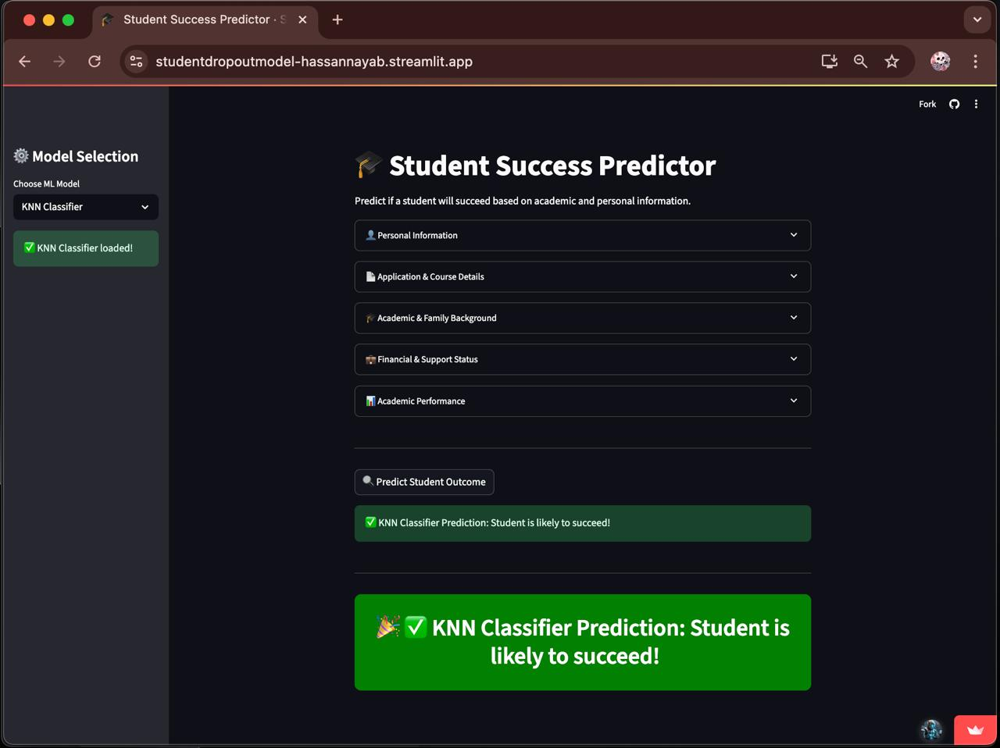

# Student Success Predictor

An interactive, ML-powered Streamlit app that predicts whether a student is likely to succeed—based on their academic, personal, and financial background.


## Try It Live

[Launch the App](https://studentdropoutmodel-hassannayab.streamlit.app/)  



## Features

- Predict outcomes using KNN, Decision Tree, or Random Forest models  
- Compare all models via majority voting  
- Simple, user-friendly interface  
- Visual feedback with emojis, confetti, and snow  


## Models

All models are pre-trained and saved as `.pkl` files using `joblib`.

- **K-Nearest Neighbors (KNN)**
- **Decision Tree**
- **Random Forest**


## 🛠️ Run It Locally

1. **Clone the repo**
   ```bash
   git clone https://github.com/vinabi/stdropout
   cd stdropout
   

#### If you find this project helpful, don’t forget to star the repo! 🎀
